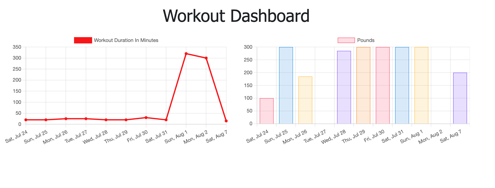

# Workout Tracker 

## Description

The purpose of this project was to create a workout tracker that allows a user to log multiple exercises within a workout in order to live a healthier, more organized lifestyle. This project utilizes MongoDB to store user inputs.

[Visit the deployed application](https://desolate-plateau-88804.herokuapp.com/)

## Table of Contents

1. [Installation](#Installation)
2. [Usage](#Usage)
3. [Contributing](#Contributing)
4. [License](#License)
5. [Tests](#Tests)
6. [Questions](#Questions)

## Installation

The user does not require any installations for usage. For development, this project requires Node.js as well as Mongoose.js and Express.js. The developer will need to run `npm i` before working with the code in this repository.

## Usage

The user can create a new workout by clicking the "New Workout" button, and select from two types of exercises, or the user can choose to continue adding exercises to an existing workout by selecting "Continue Workout". The user can also view their cumulative stats across all workouts on the Dashboard page, displayed below.

## Contributing

This project was created independently.

## License

The MIT License (MIT)

Copyright (c) 2021 Emily Rendleman

Permission is hereby granted, free of charge, to any person obtaining a copy of this software and associated documentation files (the "Software"), to deal in the Software without restriction, including without limitation the rights to use, copy, modify, merge, publish, distribute, sublicense, and/or sell copies of the Software, and to permit persons to whom the Software is furnished to do so, subject to the following conditions:

The above copyright notice and this permission notice shall be included in all copies or substantial portions of the Software.

THE SOFTWARE IS PROVIDED "AS IS", WITHOUT WARRANTY OF ANY KIND, EXPRESS OR IMPLIED, INCLUDING BUT NOT LIMITED TO THE WARRANTIES OF MERCHANTABILITY, FITNESS FOR A PARTICULAR PURPOSE AND NONINFRINGEMENT. IN NO EVENT SHALL THE AUTHORS OR COPYRIGHT HOLDERS BE LIABLE FOR ANY CLAIM, DAMAGES OR OTHER LIABILITY, WHETHER IN AN ACTION OF CONTRACT, TORT OR OTHERWISE, ARISING FROM, OUT OF OR IN CONNECTION WITH THE SOFTWARE OR THE USE OR OTHER DEALINGS IN THE SOFTWARE.

## Tests

There are currently no tests for this project.

## Questions

Reach out to me at emilyrendleman@gmail.com if you have questions about this project.
You can explore more of my projects at https://github.com/emrendle.
